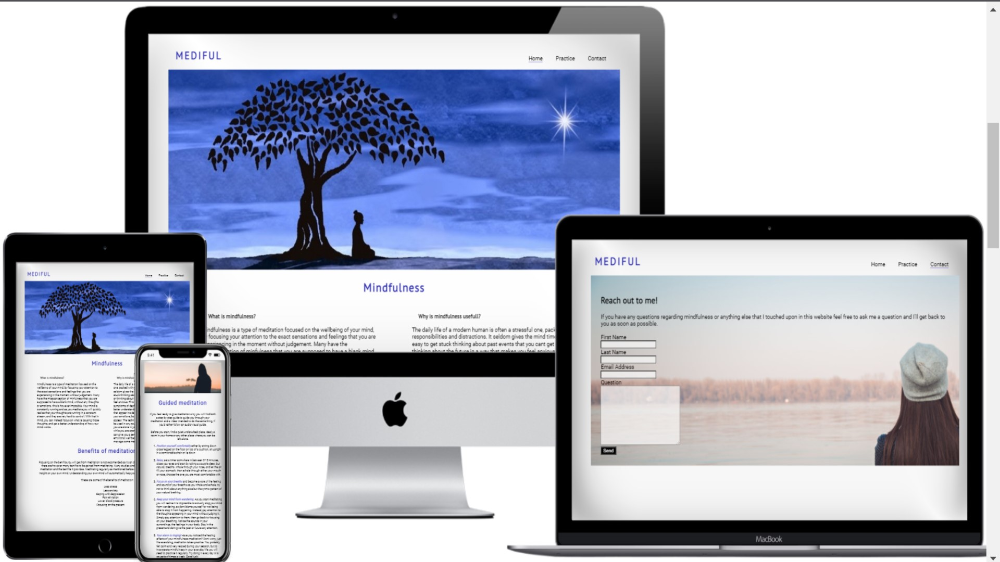
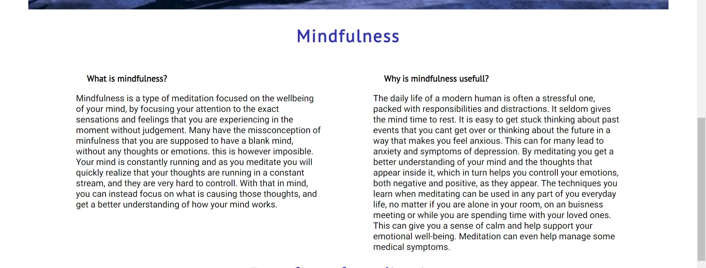
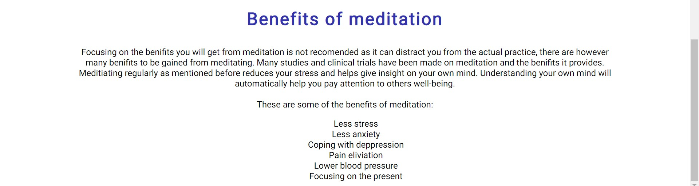
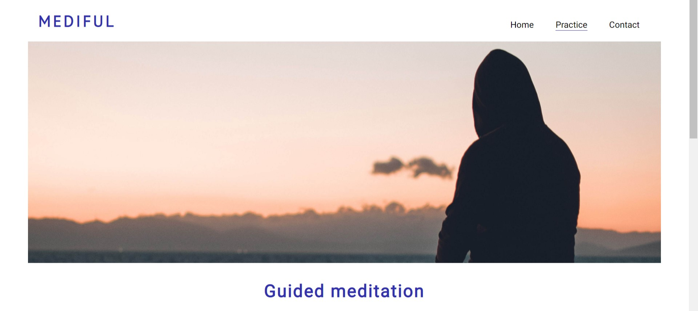
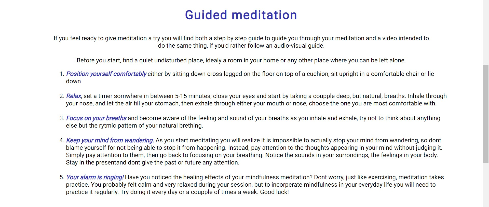
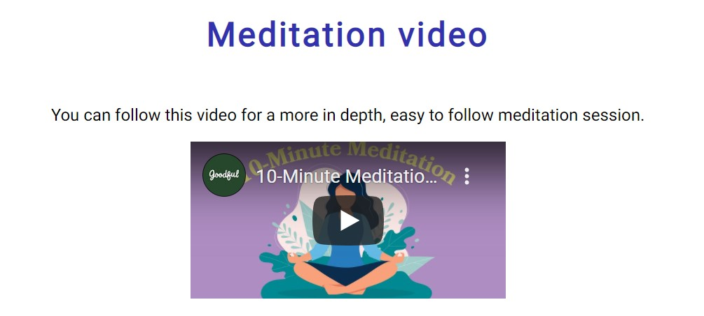
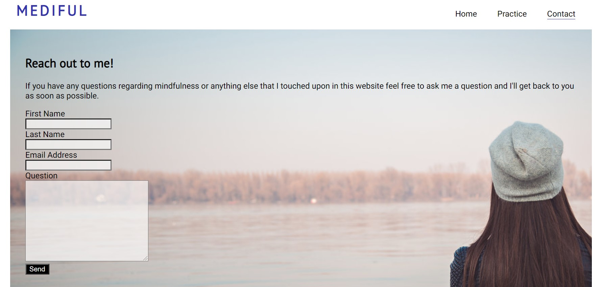
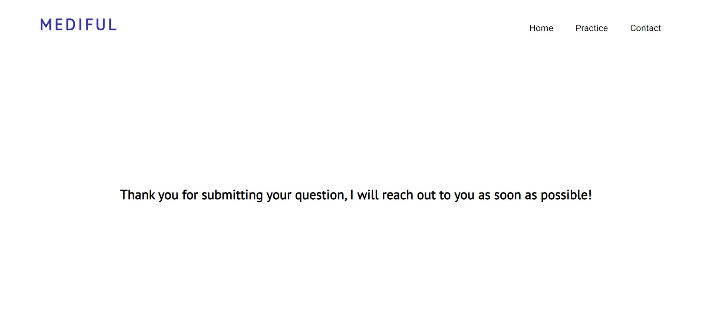

# MEDIFUL

MEDIFUL is a site with the intention to introduce people to mindfulness meditation. It is supposed to give people who have not yet tried meditating an overlook of what it is 
and a guide to their first session. It guides you either via a step by step guide or a video with the same intention. The site explains the benefits of meditation and why 
everyone should try it.

### Existing Features

- __Navigation Bar__

  - Featured on all three pages, the full responsive navigation bar includes links to the Logo, Home page, Gallery and Sign Up page and is identical in each page to allow for easy navigation.
  - This section will allow the user to easily navigate from page to page across all devices without having to revert back to the previous page via the ‘back’ button. 

- __First banner__

  - The first banner is simply there for visual stimulation and to grab the users attention.

- __Mindfulness section__

  -  This section explains what mindfulness is and briefly explains why it is useful.  It gives the user an overwiev of the rest of the sites content
   

- __Benefits__

  - The benefin section gives the user a list of benefits to be gained from meditation and has a paragraph talking about the benefits.
  - This section is meant to further incourage the user to practice meditation.

- __Practice banner__ 

  - This banner has the same purpuse as the banner on the home page. 
  - The banner is meant to capture the attention of the user and the colors on the image are meant to be calming.

- __Guided meditation__

  - This section gives the user a step by step meditation guide to follow. 
  - It's a short and simple meditation session perfect for a beginner.

- __Meditation video__

  - This section gives the user the oppertunity to watch a video guiding the user through their first session.
  - Giving the user this option is great if the user rather follows a audio-visual instruction. 

For some/all of your features, you may choose to reference the specific project files that implement them.

-__Contact page__

-This page gives the user the option to send me a question. After sending the question the user will be redirected to a new page thanking them for submitting it.

### Features Left to Implement

- I want to make one last page, telling the user about an app called "Waking Up". This is a mindfulness app I really enjoy myself and i think its a great way for new mindfulness practitioners to progress in their mindfulness journey.
- I had to prioretize finishing the rest of my site before this and was left with no time to create this page.

## Testing 

I tested the navigation bar by clicking the different navigation opptions on every page to see if they directed me the right way. While doing this i also checked if my
"class="active"" which underlined the page I was currently viewing in the navigation section worked. This was also tested on my phone.

I tried viewing my site on different screen sizes, first by using the google chrome "inspect" tool. This was crucial to see how responsive my site was. 
When an element didnt behave as I wanted it to I played around with the code in the "inspect" tool until it worked as I wanted it to. This was a process i had to repeat many
times and on every page. When I felt happy with the site I tried visiting it on my phone to make sure there were no bugs. This also ensured that my "@media screen" property
worked.

I watched the video on my computer and on my phone and made sure all the controlls (such as the play- and fullscreen button) worked.

I tried filling out the form and submitting it. This tested if the user is able to input text in the different input element. It also tested if the submit button redirected me
to my submit.html page. This was problematic at first as the submit button either sent me to an error message page, or it cleard the form. By putting the submit button
outside of the form elemnt and wrapping it in an <a> element I got it to work.
